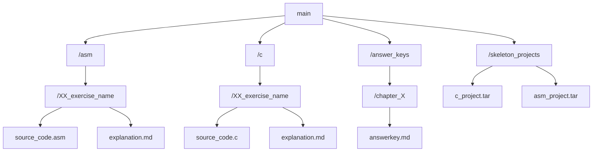
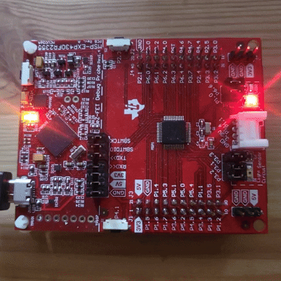

# Embedded Systems Design exercises
Based on 📚MSP430FR2355 LaunchPad by Brock LaMeres.

<p>
  
  <b>This repository is under construction</b>
</p>

## Links to the Material
- [YouTube Playlist](https://www.youtube.com/playlist?list=PL643xA3Ie_EuHoNV7AgvJXq-z1hrE8vsm)
- [Amazon Listing](https://www.amazon.com/Embedded-Systems-Design-MSP430FR2355-LaunchPadTM/dp/3030405761)

## About

This repository contains modified source code with explanations from the book and YouTube playlist, and my solutions to exercises at the end of each chapter. 

## Goal

I created this repository to help keep myself accountable, provide a quick reference point for others, and learn proper documentation for projects.

## The Structure

The repository is structured this way:



Files in folders are numbered and named by their functions. Each exercise source code is accompanied by an in-depth explanation and overview of relevant concepts. 
* I included a skeleton project with all the necessary dependencies.
* When possible, there will be a demo included.

Example:
```
~/asm/01_BLINKY/...
```

## Tools Used

- MSP430FR2355 Launchpad
- Code Composer Studio
- ASM (MSP430)
- C (MSP430)

## Progress Checklist

- [ ] ASM portion (3/38)
- [ ] C portion (0/?)
- [ ] Answer Key (0/17)

## How To Use

1. Connect MSP430FR2355
2. Clone the repository
3. Open Code Composer Studio
4. Import the skeleton project
5. Replace the source file in the project
6. Build and run
7. Make it blink! :)

<p align="center">
  
</p>

Blinking demo on MSP430FR2355 from the [Blinky Exercise](./asm/01_BLINKY).

## Contributing

Feel free to suggest improvements and point out mistakes. 

## Disclaimer 

All solutions and explanations are written by me.
