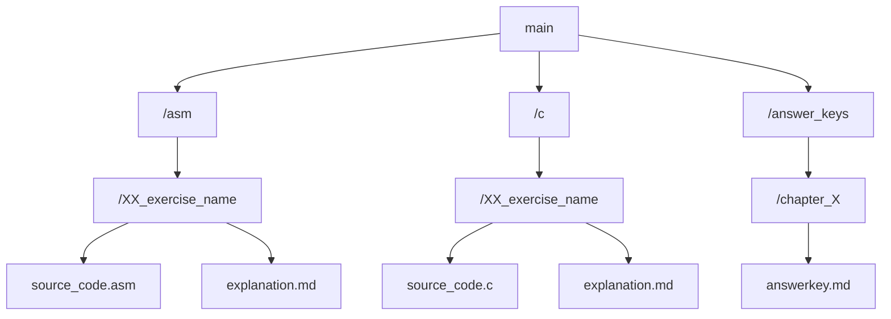

# Embedded Systems Design exercises
Based on 📚MSP430FR2355 LaunchPad by Brock LaMeres.

<p>
  
  <b>This repository is under construction</b>
</p>

## Links
- [YouTube Playlist](https://www.youtube.com/playlist?list=PL643xA3Ie_EuHoNV7AgvJXq-z1hrE8vsm)
- [Amazon Listing](https://www.amazon.com/Embedded-Systems-Design-MSP430FR2355-LaunchPadTM/dp/3030405761)

## About

This repository contains modified source code with explanations from the book and YouTube playlist, and an answer key to exercises at the end of each chapter. 

## Goal

I created this repository to help keep myself accountable, provide a quick reference point for others, and learn proper documentation for projects.

## The Structure

The repository is structured this way:



Files in folders are numbered and named by their functions. Each exercise source code is accompanied by an in-depth explanation and overview of relevant concepts. 
* Each folder can be run in CCS with no modifications.

Example:
```
~/asm/01_BLINKY/...
```

## Tools Used

- Code Composer Studio
- ASM (MSP430)
- C (MSP430)

## Contributing

Feel free to suggest improvements and point out mistakes. 

## Progress Checklist

- [ ] ASM portion (0/38)
- [ ] C portion (0/?)
- [ ] Answer Key (0/17)

## How To Use

- Clone the repo
- Open the exercise folder in CCS (Code Composer Studio)
- Navigate to the desired exercise file
- Build and run the code
- Make the MSP430 blink :)
