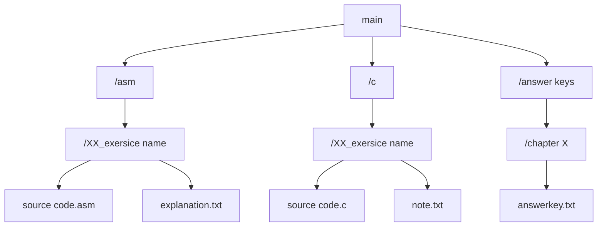

# 📚 Embedded Systems Design using the MSP430FR2355 LaunchPad by Brock LaMeres

  
  <b>This repository is under construction</b>

## Links
- [YouTube Playlist](https://www.youtube.com/playlist?list=PL643xA3Ie_EuHoNV7AgvJXq-z1hrE8vsm)
- [Amazon Listing](https://www.amazon.com/Embedded-Systems-Design-MSP430FR2355-LaunchPadTM/dp/3030405761)

## About

This repository contains modified source codes with explanations from the book/Youtube playlist and, in future, an answer key to exercises at the end of each chapter. 

## Goal

I created this repository to help keep myself accountable, provide a quick reference point for others, and learn proper documentation for projects.

## The Structure

The repository is structured this way:

Files in folders are numbered and named by their functions. Each exercise source code is accompanied by an in-depth explanation and overview of relevant concepts. 

## Tools Used

I used Code Composer Studio writing with ASM and C languages for MSP430FR2355 LaunchPad.

## Contributing

Feel free to suggest improvements and point out mistakes. 

## Progress Checklist

- [ ] ASM portion (0/38)
- [ ] C portion (0/?)
- [ ] Answer Key (0/17)
