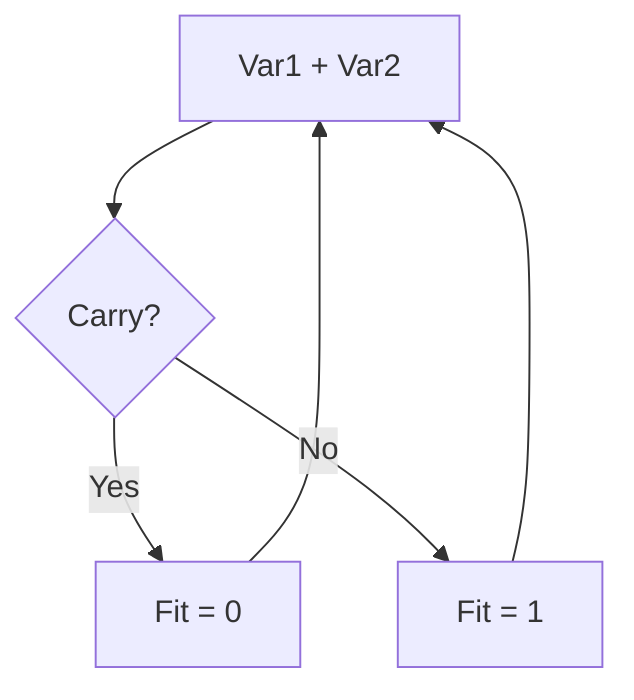

!!! It is supposed to be tested in Debug by going to memory address ```0x2000``` (the start of the program memory) and modifying the values there.

This file contains an implementation of the flowchart below. It checks if the sum of two numbers fit a 16-bit word. If addition generates a carry, meaning it does not fit, 0 is put in Fit. Otherwise, it fits and a 1 is stored in Fit.



Concepts covered:
- program creation based on a flowchart
